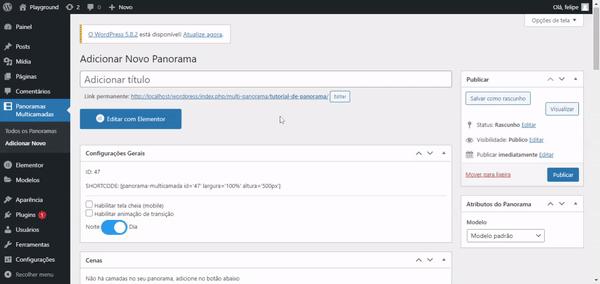
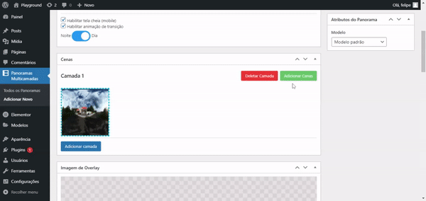

<h1 align="center">
    <br />
    <p align="center">
    	
    </p>
    <br />
    Panorama Multicamada v6
    <br />
</h1>

<h4 align="center">
    Adiciona widget de panorama ao elementor com diversas funcionalidades: camadas, imagem de overlay, prévia dos cômodos, dia e noite, minimapa, etc.
</h4>

<p align="center">
  <a href="#principais-funcionalidades">Principais Funcionalidades</a> •
  <a href="#como-usar">Criando Seu Primeiro Panorama</a> •
  <a href="#como-baixar">Como baixar</a> •
  <a href="#credits">Credits</a> •
  <a href="#related">Related</a> •
  <a href="#license">License</a>
</p>

<p align="center">
  
  <br />
  <i>Projeto da empresa <a href="https://atosprojetos.com.br/unaxoffshore/">Atos Projetos</a> feito com o nosso plugin ❤️</i>
</p>

## Principais Funcionalidades

* Minimapa 
  - Um pequeno minimapa pode ser adicionado ao seu panorama para mostrar onde você está em relação a outros pontos do minimapa.
* Dia e Noite
  - Você pode fazer uma versão de dia e de noite do mesmo panorama.
* Camadas ou "andares"
  - Se a sua construção conta com vários andares ou pavimentos, você pode adicioná-los que aparecerão no minimapa.
* Prévias
  - Ao passar o mouse por cima de um "hot spot", um pequeno balãozinho irá aparecer mostrando o outro cômodo. Você também pode deixar apenas um texto.
* Editor rico de opções! Você pode:
  - Mudar a proporção do minimapa e das bolinhas do minimapa, tanto na versão de celular, quanto de desktop.
  - Mudar a imagem de Overlay.
  - Habilitar/Desabilitar elementos.

## Como Usar

Copie e cole o shortcode do plugin no Elementor:

```
[panorama-multicamada id='45' largura='100%' altura='500px']

```
Todos esses parâmetros podem ser mudados (id, largura e altura).
O id tem que ser correspondente ao id do panorama.

### Passo 1

* Verifique algumas primeiras configurações
* Adicione uma camada no botão "Adicionar Camada"



<hr />

### Passo 2 

* Adicione mais cenas se precisar



<hr />

### Passo 3

* Adicione um Hot Spot
* Configure o local para onde ele entra
* Adicione uma imagem de prévia


## Como Baixar

Você deve baixar clicando neste <a href="https://github.com/felipe1234-dev/panorama-multicamada/raw/main/multi-panorama-plugin-react.zip">link</a>, em seguida, vá até o seu WordPress e passe o mouse por cima de ***Plugins*** *(barra lateral)* > ***Adicionar Novo*** > ***Carregar plugin*** *(topo)* > ***Escolher Arquivo*** e escolha o arquivo Zip que foi baixado, e **Instalar**.

## Emailware

Markdownify is an [emailware](https://en.wiktionary.org/wiki/emailware). Meaning, if you liked using this app or it has helped you in any way, I'd like you send me an email at <bullredeyes@gmail.com> about anything you'd want to say about this software. I'd really appreciate it!

## Credits

This software uses the following open source packages:

- [Electron](http://electron.atom.io/)
- [Node.js](https://nodejs.org/)
- [Marked - a markdown parser](https://github.com/chjj/marked)
- [showdown](http://showdownjs.github.io/showdown/)
- [CodeMirror](http://codemirror.net/)
- Emojis are taken from [here](https://github.com/arvida/emoji-cheat-sheet.com)
- [highlight.js](https://highlightjs.org/)

## Related

[markdownify-web](https://github.com/amitmerchant1990/markdownify-web) - Web version of Markdownify

## Support

<a href="https://www.buymeacoffee.com/5Zn8Xh3l9" target="_blank"></a>

<p>Or</p> 

<a href="https://www.patreon.com/amitmerchant">
	
</a>

## You may also like...

- [Pomolectron](https://github.com/amitmerchant1990/pomolectron) - A pomodoro app
- [Correo](https://github.com/amitmerchant1990/correo) - A menubar/taskbar Gmail App for Windows and macOS

## License

MIT

---

> [amitmerchant.com](https://www.amitmerchant.com) &nbsp;&middot;&nbsp;
> GitHub [@amitmerchant1990](https://github.com/amitmerchant1990) &nbsp;&middot;&nbsp;
> Twitter [@amit_merchant](https://twitter.com/amit_merchant)


# panorama-multicamada

Adiciona widget de panorama no elementor. Correção de bugs, estouro de memória, código refeito e reorganizado, muitas novas funcionalidades no editor, camadas. Inspirado e trbalhado por cima do projeto de jvcalassio (a página dele: https://jvcalassio.github.io), dê um olá para ele e aproveita também para acessar a minha página!
