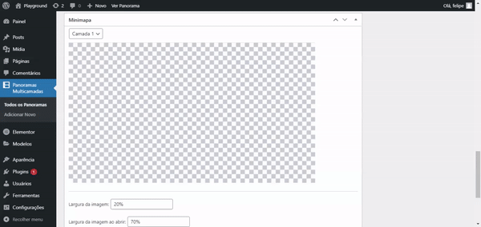

<h1 align="center">
    <br />
    <p align="center">
    	
    </p>
    <br />
    Panorama Multicamada v6
    <br />
</h1>

<h4 align="center">
    Adiciona widget de panorama ao elementor com diversas funcionalidades: camadas, imagem de overlay, prévia dos cômodos, dia e noite, minimapa, etc.
</h4>

<p align="center">
  <a href="#principais-funcionalidades">Principais Funcionalidades</a> •
  <a href="#como-usar">Criando Seu Primeiro Panorama</a> •
  <a href="#como-baixar">Como baixar</a> •
  <a href="#creditos">Créditos</a> •
  <a href="#linguagens-usadas">Linguagens Usadas</a> •
  <a href="#licenc-a">Licença</a>
</p>

<p align="center">
  
  <br />
  <i>Projeto da empresa <a href="https://atosprojetos.com.br/unaxoffshore/">Atos Projetos</a> feito com o nosso plugin ❤️</i>
</p>

## Principais Funcionalidades

* Minimapa 
  - Um pequeno minimapa pode ser adicionado ao seu panorama para mostrar onde você está em relação a outros pontos do minimapa.
* Dia e Noite
  - Você pode fazer uma versão de dia e de noite do mesmo panorama.
* Camadas ou "andares"
  - Se a sua construção conta com vários andares ou pavimentos, você pode adicioná-los que aparecerão no minimapa.
* Prévias
  - Ao passar o mouse por cima de um "hot spot", um pequeno balãozinho irá aparecer mostrando o outro cômodo. Você também pode deixar apenas um texto.
* Editor rico de opções! Você pode:
  - Mudar a proporção do minimapa e das bolinhas do minimapa, tanto na versão de celular, quanto de desktop.
  - Mudar a imagem de Overlay.
  - Habilitar/Desabilitar elementos.

## Como Usar

Copie e cole o shortcode do plugin no Elementor:

```
[panorama-multicamada id='45' largura='100%' altura='500px']

```
Todos esses parâmetros podem ser mudados (id, largura e altura).
O id tem que ser correspondente ao id do panorama.

### Passo 1

* Verifique algumas primeiras configurações
* Adicione uma camada no botão "Adicionar Camada"


<hr />

### Passo 2 

* Adicione mais cenas se precisar


<hr />

### Passo 3

* Adicione um Hot Spot
* Configure o local para onde ele entra
* Adicione uma imagem de prévia


<hr />

### Passo 4

* Troque a imagem da planta no botão "Modificar Planta"
* Clique em posições no mapa para adicionar items 
* Configure para qual cena cada item redireciona



## Como Baixar

Você deve baixar clicando neste <a href="https://github.com/felipe1234-dev/panorama-multicamada/raw/main/multi-panorama-plugin-react.zip">link</a>, em seguida, vá até o seu WordPress e passe o mouse por cima de ***Plugins*** *(barra lateral)* > ***Adicionar Novo*** > ***Carregar plugin*** *(topo)* > ***Escolher Arquivo*** e escolha o arquivo Zip que foi baixado, e **Instalar**.

## Créditos

Este plugin usa os seguintes pacotes de fonte aberta:

- [React](https://reactjs.org/)
- [Pannellum](https://pannellum.org/)

## Linguagens Usadas

PHP, JavaScript, CSS e HTML.

## Licença

MIT

---